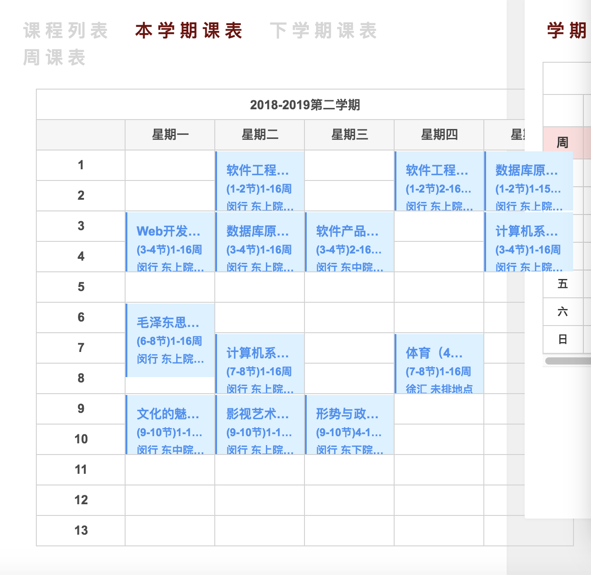

### My analyse of The Home Page Loading of SJTU

#### 1、put a lot of stuff in \<head>
like
\<!--jQuery核心框架库 -->

\<!--jQuery浏览器检测 --> 

\<!--jQuery自定义event事件库 -->

\<!--Bootstrap布局框架-->

\<!--jQuery常用工具扩展库：基础工具,资源加载工具,元素尺寸相关工具 -->

\<!--国际化js库 -->
etc.

JQuery was used for response, BootStrap framework was used for layout, and many plugins were used to beautify the page.

#### 2、There are a lot of comments

As you can see from the code, each HTML element is preceded by a similar \<! JQuery core framework library --> comments, indicating the purpose of this piece of code or element, so that the development of the structure is very clear, conducive to development.

#### 3、The main structure
>The <body> tag has a class indicating container, divided into navbar, body and footer.

The body also contains links to JavaScript and jQuery code to dynamically respond to events that occur on the page.

The main body is also used as a container, which contains the elements of my application, my messages, teaching files, class schedule and teaching calendar. Each element presents different information. You can dynamically fetch information from the server and render it.
#### 4、Identify areas for improvement

>Part in the schedule, that is, course list, schedule, schedule, weekly schedule for next semester, this semester as mouse clicks and display different content, but the form of writing is not good enough, when to change the window size, the contents of the display offset, for mobile display unfriendly, some course name already is beyond the scope of their cell, are beautiful enough.

**my solution**：The layout can be reconfigured using bootstrap to add support for mobile display for better display results. At the same time, modify the external CSS file to make the display of relevant information more reasonable and beautiful.