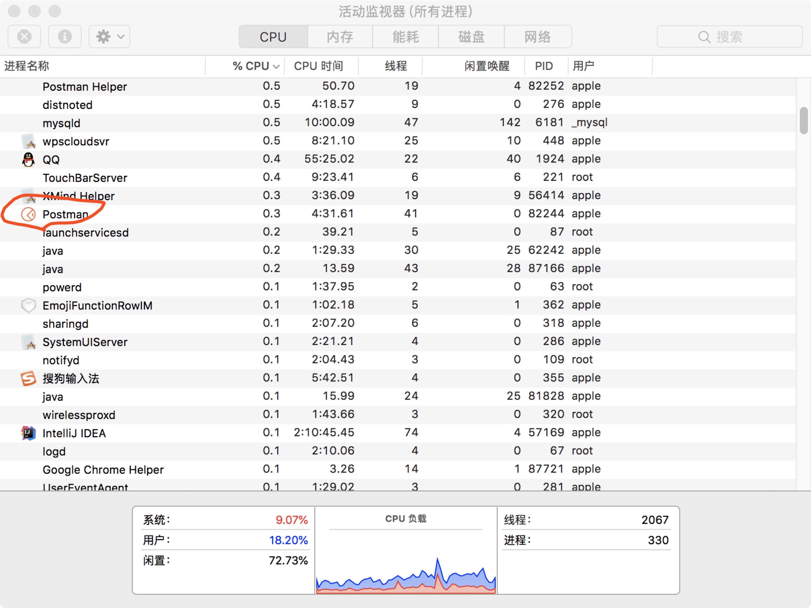

### Find resource consumption of my RESR service

#### 本机相关信息
1、处理器 3.1 GHz Intel Core i5  
2、内存 8 GB 2133 MHz LPDDR3  
3、图形卡 Intel Iris Plus Graphics 650 1536 MB
#### 一、在空闲时 即不发请求时

1、postman占用的内存如图 116.8mb  

2、postman占用的cpu如图，2.3%左右

#### 在发一条请求时 

postman占用的内存如图 127.4mb

postman占用的cpu如图，0.3%左右

#### 在发多条请求时（手动发送20条） 
连续发送http://localhost:8080/ladder?start=cat&end=dog

postman占用的内存如图 206.2mb

postman占用的cpu如图，10.1%左右

#### 总结：
    由此可见，postman占用内存在100-200mb之间，随着发送请求数量的增加，占用内存也相应增加。 占用cpu情况变化较大，空闲时仅占0.3%，发送一条指令占2.3%，发送多条指令可以飙升到10.1%。
    由此可见对指令最大数量的约束是必要的。
